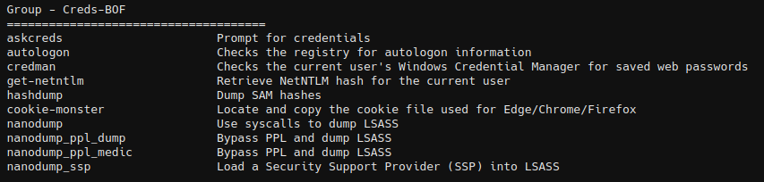

# Creds-BOF

BOF tools that can be used to harvest passwords.




## askcreds

A BOF tool that can be used to collect passwords using CredUIPromptForWindowsCredentialsName.

```
askcreds [-p prompt] [-n note] [-t wait_time]
```


## autologon

Checks the registry for autologon information.

```
autologon
```


## cookie-monster

Steal browser cookies and logins data for edge, chrome and firefox through a BOF! [More details](https://github.com/Adaptix-Framework/Extension-Kit/blob/main/Creds-BOF/cookie-monster/README.md)


## credman

Checks the current user's Windows Credential Manager for saved web passwords and returns them.

```
credman
```


### get-netntlm

This is a port of Internal Monologue from https://github.com/GhostPack/Seatbelt. Like Seatbelt, this code will utilize the local SSPI to elict NetNTLM and therefore little to no network traffic will be generated. The `--no-ess` option can be utilized and if you would like the attempt to disable session security in NetNTLMv1

```
get-netntlm [--no-ess]
```


## hashdump

Gathers NTLM hashes from SAM and SYSTEM.

```
hashdump
```

The **Hashdump** item will be added to the **Access** menu in the Sessions Table and Graph.


## lsadump

BOF tools for dumping LSA secrets, SAM hashes, and cached domain credentials from Windows systems.

### lsadump_secrets

Dumps LSA secrets from the SECURITY registry hive. Extracts and decrypts LSA secrets including default password, DPAPI master keys, service account passwords, auto-logon credentials, and more. Requires SYSTEM privileges.

```
lsadump_secrets
```

### lsadump_sam

Dumps SAM hashes directly from the registry. Extracts NTLM hashes for all local user accounts from the SAM registry hive. Requires admin privileges.

```
lsadump_sam
```

Automatically extracts and adds discovered credentials to Adaptix credentials store.

### lsadump_cache

Dumps cached domain credentials (DCC2/MSCacheV2) from the registry. Extracts cached domain credentials for domain users who have logged on to the system. Requires SYSTEM privileges.

```
lsadump_cache
```

Automatically extracts and adds discovered cached credentials to Adaptix credentials store.


## nanodump

A flexible tool that creates a minidump of the LSASS process. [More details](https://github.com/Adaptix-Framework/Extension-Kit/blob/main/Creds-BOF/nanodumnp/README.md)


## underlaycopy

A low-level file copy tool that copies files using direct NTFS volume access, bypassing file locks and access restrictions. [More details](https://github.com/Adaptix-Framework/Extension-Kit/blob/main/Creds-BOF/UnderlayCopy-BOF/README.md)


## Credits
* C2-Tool-Collection - https://github.com/outflanknl/C2-Tool-Collection
* PrivCheck - https://github.com/ostrichgolf/PrivCheck
* nanodump - https://github.com/fortra/nanodump
* Get-NetNTLM - https://github.com/KingOfTheNOPs/Get-NetNTLM
* LSAdump - https://github.com/shashinma/LSAdump-BOF
* UnderlayCopy-BOF - https://github.com/shashinma/UnderlayCopy-BOF